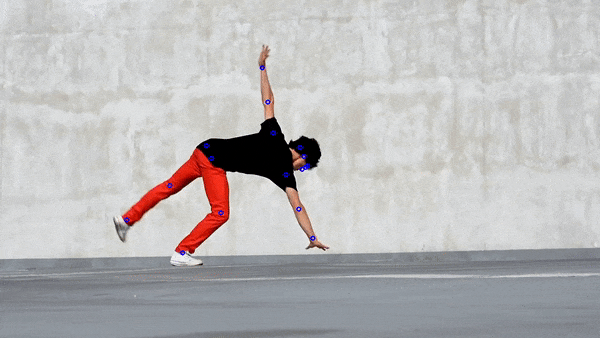

This demo code is meant to be run on a video and includes a person detector.
[Nvidia-docker](https://github.com/NVIDIA/nvidia-docker) and GPUs are required.
It only expects there to be one person in each frame of video, though the code could easily be extended to support multiple people.

### Prep
1. Download the researchers' pretrained pose estimator from [google drive](https://drive.google.com/drive/folders/1hOTihvbyIxsm5ygDpbUuJ7O_tzv4oXjC?usp=sharing) to this directory under `models/`
2. Put the video file you'd like to infer on in this directory under `videos`
3. build the docker container in this directory with `./build-docker.sh` (this can take time because it involves compiling opencv)
4. update the `inference-config.yaml` file to reflect the number of GPUs you have available

### Running the Model
Start your docker container with:
```
nvidia-docker run --rm -it \
  -v $(pwd)/output:/output \
  -v $(pwd)/videos:/videos \
  -v $(pwd)/models:/models \
  -w /pose_root \
  hrnet_demo_inference \
  /bin/bash
```

Once the container is running, you can run inference with:
```
python tools/inference.py \
  --cfg inference-config.yaml \
  --videoFile /videos/my-video.mp4 \
  --inferenceFps 10 \
  --writeBoxFrames \
  TEST.MODEL_FILE \
  /models/pytorch/pose_coco/pose_hrnet_w32_384x288.pth
```

The command above will output frames with boxes,
frames with poses,
a video with poses,
and a csv with the keypoint coordinates for each frame.



Original source for demo video above is licensed for `Free for commercial use No attribution required` by [Pixabay](https://pixabay.com/service/license/)
