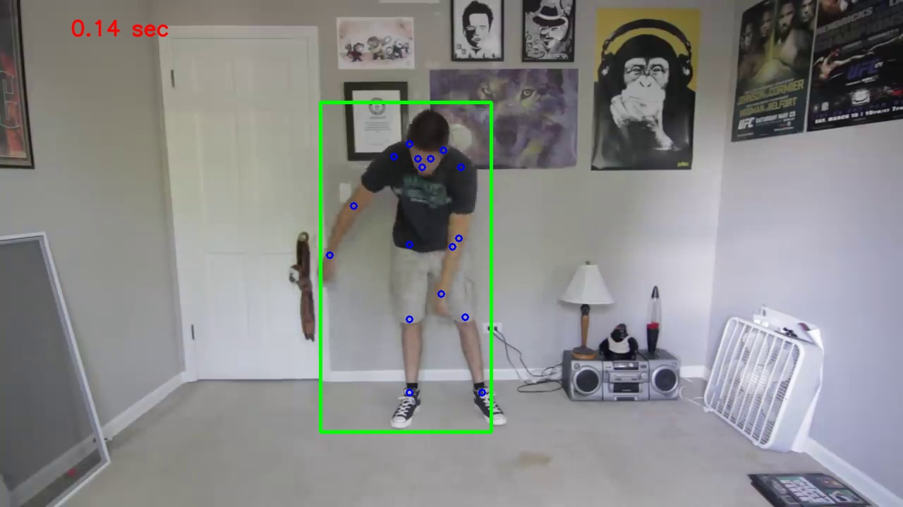
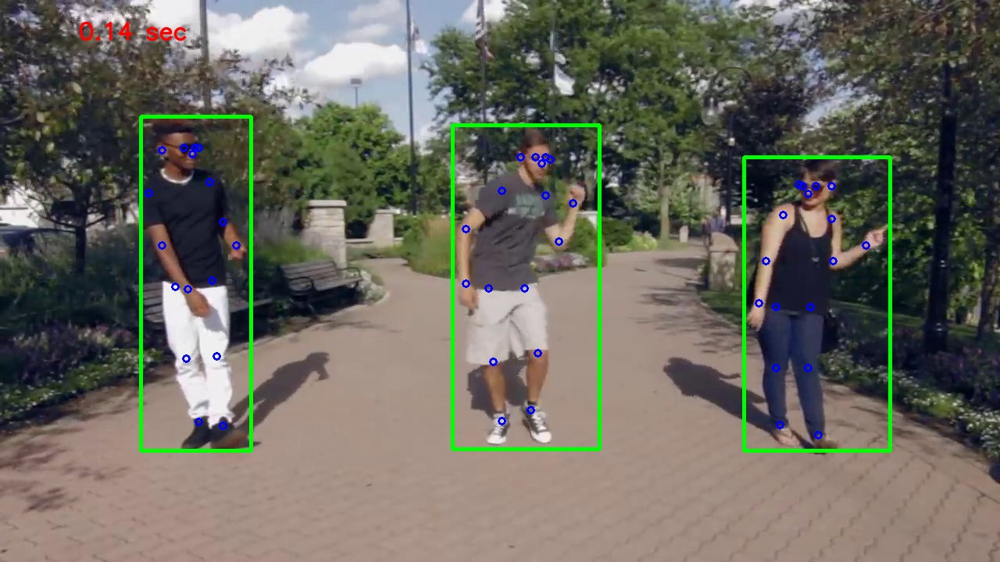
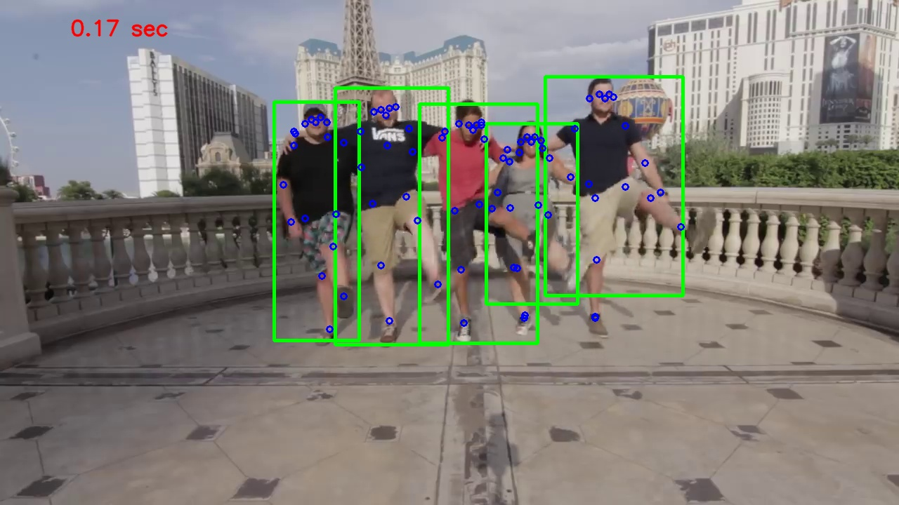
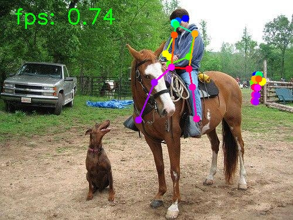
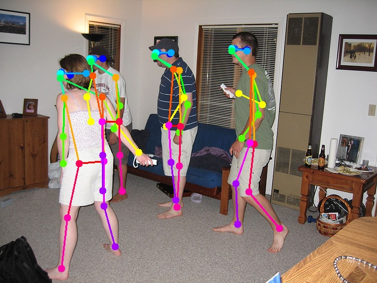

# Inference hrnet

Inferencing the deep-high-resolution-net.pytoch without using Docker. 

## Prep
1. Download the researchers' pretrained pose estimator from [google drive](https://drive.google.com/drive/folders/1hOTihvbyIxsm5ygDpbUuJ7O_tzv4oXjC?usp=sharing) to this directory under `models/`
2. Put the video file you'd like to infer on in this directory under `videos`
3. (OPTIONAL) build the docker container in this directory with `./build-docker.sh` (this can take time because it involves compiling opencv)
4. update the `inference-config.yaml` file to reflect the number of GPUs you have available and which trained model you want to use.

## Running the Model
### 1. Running on the video
```
python demo/inference.py --cfg demo/inference-config.yaml \
    --videoFile ../../multi_people.mp4 \
    --writeBoxFrames \
    --outputDir output \
    TEST.MODEL_FILE ../models/pytorch/pose_coco/pose_hrnet_w32_256x192.pth 

```

The above command will create a video under *output* directory and a lot of pose image under *output/pose* directory. 
Even with usage of GPU (GTX1080 in my case), the person detection will take nearly **0.06 sec**, the person pose match will
 take nearly **0.07 sec**. In total. inference time per frame will be **0.13 sec**, nearly 10fps. So if you prefer a real-time (fps >= 20) 
 pose estimation then you should try other approach.

**===Result===**

Some output images are as:


Fig: 1 person inference


Fig: 3 person inference


Fig: 3 person inference

### 2. Demo with more common functions
Remember to update` TEST.MODEL_FILE` in `demo/inference-config.yaml `according to your model path.

`demo.py` provides the following functions:

- use `--webcam` when the input is a real-time camera.
- use `--video [video-path]`  when the input is a video.
- use `--image [image-path]` when the input is an image.
- use `--write` to save the image, camera or video result.
- use `--showFps` to show the fps (this fps includes the detection part).
- draw connections between joints.

#### (1) the input is a real-time carema
```python
python demo/demo.py --webcam --showFps --write
```

#### (2) the input is a video
```python
python demo/demo.py --video test.mp4 --showFps --write
```
#### (3) the input is a image

```python
python demo/demo.py --image test.jpg --showFps --write
```

**===Result===**



Fig: show fps



Fig: multi-people